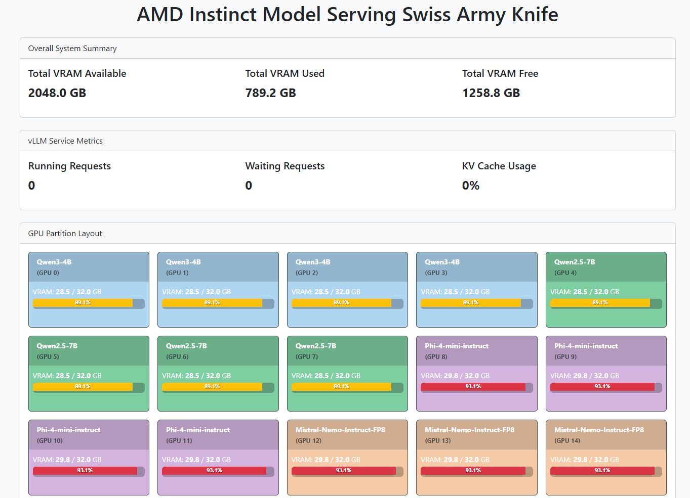
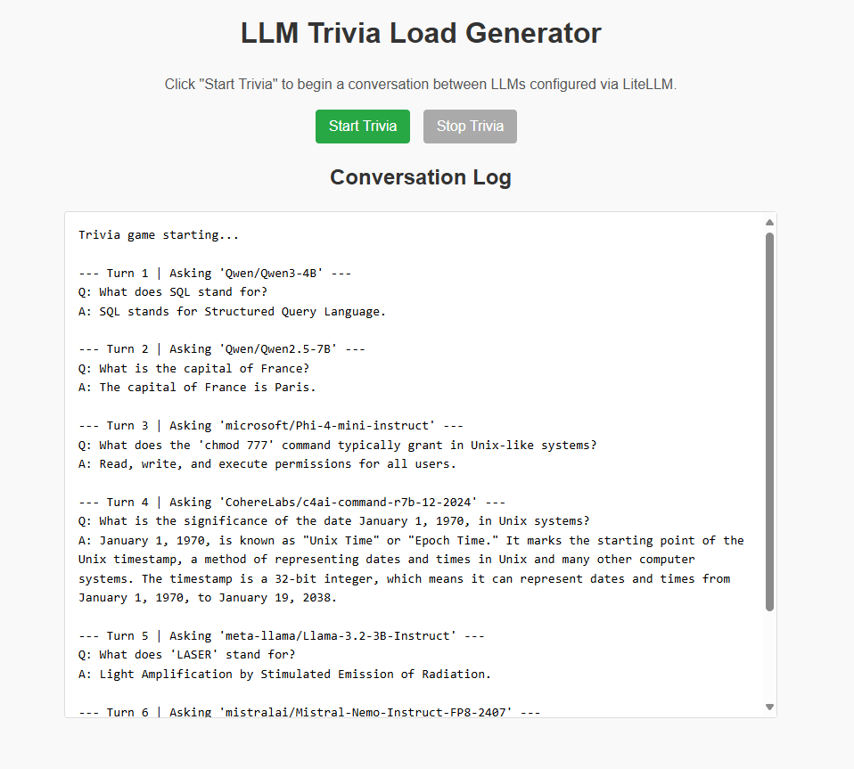
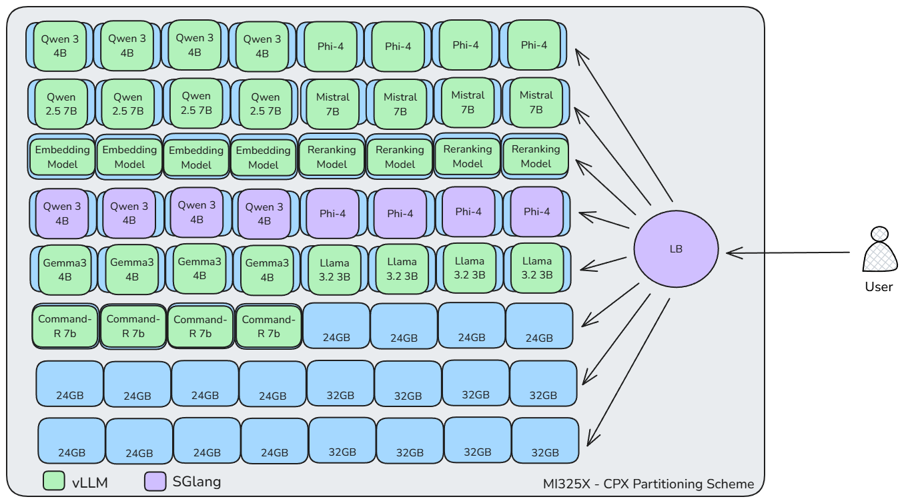

# Model Serving Swiss Army Knife: Multi-Modal AI Inference on AMD Instinct

## Overview

This repository contains the files needed to set up a comprehensive model serving platform on AMD Instinct GPUs. The project leverages GPU partitioning for efficient resource utilization and deploys multiple inference servers to handle various model types through a unified API.

This demo was originally presented at [AI Infra Summit 3](https://aiinfra.live) on May 3, 2025.

## Key Features

- **Multi-Model Deployment**: Deploy multiple models of different sizes and architectures simultaneously
- **GPU Partitioning**: Efficient utilization of AMD Instinct GPUs using Compute Partition (CPX) mode
- **Unified API**: Single OpenAI-compatible endpoint for accessing all models through LiteLLM proxy
- **Multiple Inference Engines**: Support for vLLM and SGLang to optimize for different model architectures
- **Real-time Monitoring**: Status dashboard showing deployed models and GPU VRAM utilization
- **Interactive UI**: Web interface for testing models and generating loads
- **Load Testing**: Built-in tools to simulate workloads and test scaling

**Many thanks** to [Vultr](https://www.vultr.com/) for providing an AMD Instinct MI325X bare metal instace to build and host this demo. Find more information about Vultr's Instinct-based offerings here: [https://www.vultr.com/products/cloud-gpu/amd-mi325x-mi300x/](https://www.vultr.com/products/cloud-gpu/amd-mi325x-mi300x/)

### Screenshots

<div align="center">


*Metrics Dashboard*

</div>
<p>
<div align="center">


*Demo Load Generator UI*

</div>

## Prerequisites

* **AMD Instinct™ GPU**: This demo is designed for AMD Instinct GPUs. Ensure you have the [necessary drivers installed](https://rocm.docs.amd.com/projects/install-on-linux/en/latest/install/quick-start.html).
* Docker and Docker Compose installed.
* Hugging Face Hub token (if downloading private models).

> **Note:** This setup utilizes `network_mode: host` in the Docker Compose configurations. This means the containers share the host's network stack, which simplifies networking between containers but has security implications. Ensure you understand the consequences before deploying in production.

## Architecture

The platform consists of the following components:

* **vLLM Instances**: Multiple instances serving various models, each targeting specific GPU partitions
* **SGLang Instances**: Additional inference servers optimized for certain model architectures
* **LiteLLM Proxy**: Unified API endpoint that routes requests to appropriate backend servers
* **Open WebUI**: Interactive interface for testing models
* **Status Dashboard**: Real-time monitoring of models and GPU utilization
* **Load Generator**: Tool for simulating workloads and testing performance

### Logical Diagram

<div align="center">


*Logical Diagram*

</div>


## Default Models

The system comes pre-configured with the following models:

| Model | Type | Server | GPU Partitions |
|-------|------|--------|----------------|
| [Qwen/Qwen3-4B](https://huggingface.co/Qwen/Qwen3-4B) | LLM | vLLM | 0-3 |
| [Qwen/Qwen2.5-7B](https://huggingface.co/Qwen/Qwen2.5-7B) | LLM | vLLM | 4-7 |
| [microsoft/Phi-4-mini-instruct](https://huggingface.co/microsoft/Phi-4-mini-instruct) | LLM | vLLM | 8-11 |
| [mistralai/Mistral-Nemo-Instruct-FP8-2407](https://huggingface.co/mistralai/Mistral-Nemo-Instruct-FP8-2407) | LLM | vLLM | 12-15 |
| [BAAI/bge-large-en-v1.5](https://huggingface.co/BAAI/bge-large-en-v1.5) | Embedding | vLLM | 16-19 |
| [BAAI/bge-reranker-v2-m3](https://huggingface.co/BAAI/bge-reranker-v2-m3) | Reranker | vLLM | 20-23 |
| [google/gemma-3-4B-it](https://huggingface.co/google/gemma-3-4B-it) | LLM | vLLM | 32-35 |
| [meta-llama/Llama-3.2-3B-Instruct](https://huggingface.co/meta-llama/Llama-3.2-3B-Instruct) | LLM | vLLM | 36-39 |
| [CohereLabs/c4ai-command-r7b-12-2024](https://huggingface.co/CohereLabs/c4ai-command-r7b-12-2024) | LLM | vLLM | 40-43 |
| [Qwen/Qwen3-4B](https://huggingface.co/Qwen/Qwen3-4B) | LLM | SGLang | 24-27 |
| [meta-llama/Llama-3.2-3B-Instruct](https://huggingface.co/meta-llama/Llama-3.2-3B-Instruct) | LLM | SGLang | 28-31 |

## Port Usage

The system uses the following TCP ports:

| Service | Port Range |
|---------|------------|
| vLLM Servers | 8000-8043 |
| SGLang Servers | 9101-9108 |
| LiteLLM Proxy | 4000 |
| Open WebUI | 8081 |
| Metrics Aggregator | 5001 |
| Load Generator | 5002 |

## GPU Partitioning Setup

This demo leverages AMD GPU partitioning and requires the GPU to be in **Compute Partition (CPX)** mode to run multiple model instances efficiently.

### Checking and Setting Partition Mode

Check current partition mode for GPU 0:
```bash
sudo amd-smi partition -g 0
```

Change to CPX mode (if necessary):
```bash
sudo amd-smi set -C cpx
```

Change back to SPX mode (if needed later):
```bash
sudo amd-smi set -C spx
```

For more details, refer to the [AMD ROCm documentation](https://rocm.docs.amd.com/) and the [Compute and Memory Modes Blog Post](https://rocm.blogs.amd.com/software-tools-optimization/compute-memory-modes/README.html).

## Getting Started

### 1. Configure Environment

Copy and edit the environment file:
```bash
cp env.example .env
```

Edit the `.env` file to set the correct paths for your model cache and model storage directories. You may also need to add your `HUGGING_FACE_HUB_TOKEN`.

### 2. Download Models

Ensure the models specified in `models.yaml` are downloaded to the directories configured in your `.env` file.

### 3. Start Services

Launch all services with Docker Compose:

```bash
docker compose up -d
```

This will start all services and run them in the background. The `depends_on` configurations ensure that services start in the correct order.

### 4. Access Interfaces

- **Status Dashboard**: http://localhost:8080
- **Open WebUI**: http://localhost:8081
- **Load Generator**: http://localhost:8080/load-generator/
- **LiteLLM API**: http://localhost:4000

### 5. Monitor Logs

```bash
docker compose logs -f <service_name>  # e.g., docker compose logs -f proxy
```

### 6. Stop Services

```bash
docker compose down
```

## Customization

### Adding New Models

To add new models:

1. Update the `models.yaml` file with your model configuration
2. Ensure the model is accessible in your model storage path
3. Restart the services with `docker compose restart proxy`
