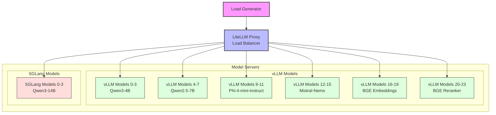

# Model Serving Swiss Army Knife: Multi-Modal AI Inference on AMD Instinct

## Overview

This repository contains the files needed to replicate the demo presented at [AI Infra Summit 3](https://aiinfra.live) on 5/3/25. It includes configurations for different inference servers (like vLLM and SGLang) and a load generator to demonstate a requests to the various models.

## Prerequisites

* **AMD Instinct™ GPU:** This demo is configured for AMD Instinct GPUs. Ensure you have the [necessary drivers installed](https://rocm.docs.amd.com/projects/install-on-linux/en/latest/install/quick-start.html).
* Docker and Docker Compose installed.
* Hugging Face Hub token (if downloading private models).

**Note:** This setup utilizes `network_mode: host` in the Docker Compose configurations. This means the containers share the host's network stack, which simplifies networking between containers but has security implications and might not be suitable for all environments. Ensure you understand the consequences before deploying in production.

## Components

This repository deploys the following services via Docker Compose:

* **vLLM Instances:** Multiple instances of the vLLM inference server, each potentially serving a different model or configuration, targeting specific GPU partitions. See `docker-compose.vllm.yaml`.
* **SGLang Instances:** Multiple instances of the SGLang inference server, similar to vLLM, for structured generation tasks. See `docker-compose.sglang.yaml`.
* **LiteLLM Proxy:** A proxy service (`proxy` in `docker-compose.litellm.yaml`) that provides a unified OpenAI-compatible API endpoint. It routes incoming requests to the appropriate backend inference server (vLLM or SGLang instances) based on the model requested. Configuration is managed via `models.yaml`.
* **Load Generator:** A simple Python script (`load-generator` in `docker-compose.load-generator.yaml`) to send requests to the LiteLLM proxy to simulate a typical workload.

## Default Models (`models.yaml`)

The `models.yaml` file configures the LiteLLM proxy, defining which backend inference server serves which model name. By default, it includes configurations for various models across the vLLM and SGLang instances, such as:

* [Qwen/Qwen3-4B](https://huggingface.co/Qwen/Qwen3-4B) (vLLM)
* [Qwen/Qwen2.5-7B](https://huggingface.co/Qwen/Qwen2.5-7B) (vLLM)
* [microsoft/Phi-4-mini-instruct](https://huggingface.co/microsoft/Phi-4-mini-instruct) (vLLM)
* [mistralai/Mistral-Nemo-Instruct-FP8-2407](https://huggingface.co/mistralai/Mistral-Nemo-Instruct-FP8-2407) (vLLM)
* [BAAI/bge-large-en-v1.5](https://huggingface.co/BAAI/bge-large-en-v1.5) (Embedding, vLLM)
* [BAAI/bge-reranker-v2-m3](https://huggingface.co/BAAI/bge-reranker-v2-m3) (Reranker, vLLM)
* [Qwen/Qwen3-14B](https://huggingface.co/Qwen/Qwen3-14B) (SGLang)

Each entry maps a model name requested via the proxy to the specific `api_base` (the URL of the backend vLLM/SGLang instance) that serves it.

## Logical Diagram



## GPU Partitioning

This demo leverages AMD GPU partitioning and requires the GPU to be in **Compute Partition (CPX)** mode.

* **SPX (Single Partition):** The default mode where the entire GPU is treated as a single unit.
* **CPX (Compute Partition):** Divides the GPU into multiple compute partitions (virtual GPUs), each with dedicated compute units and a portion of the HBM memory. This allows multiple independent workloads to run concurrently on a single physical GPU. This demo assumes CPX mode is enabled to run multiple model instances efficiently.

**Checking and Setting Partition Mode:**

You can use the `amd-smi` tool (part of the ROCm installation) to manage partitioning.

**Check Current Mode:**

Run this command to view the partition mode for GPU 0. All GPUs in the system are partitioned in the same mode, so if GPU 0 is in CPX mode, all GPUs are in CPX mode

```bash
sudo amd-smi partition -g 0
```

Omitting `-g 0` will show information for all GPUs, if needed

**Change to CPX Mode (if necessary):**

```bash
sudo amd-smi set -C cpx
```

**Change back to SPX Mode (if needed later):**

```bash
sudo amd-smi set -C spx
```

Refer to the [AMD ROCm documentation](https://rocm.docs.amd.com/) and the [Compute and Memory Modes Blog Post](https://rocm.blogs.amd.com/software-tools-optimization/compute-memory-modes/README.html) for more details.

## Usage

**Configure Environment:**

* Copy the example environment file: `cp env.example .env`
* Edit the `.env` file to set the correct paths for your model cache and model storage directories. You may also need to add your `HUGGING_FACE_HUB_TOKEN`.

**Download Models:**
  
Ensure the models specified in `models.yaml` are downloaded to the directorie specified in your `.env` file.

**Run Services:**

To start all services (vLLM, SGLang, LiteLLM Proxy, Load Generator) defined in the Compose files, simply run:

```bash
docker compose up -d
```

This command will start all services and detach, running them in the background. The `depends_on` configurations within the Compose files ensure that services start in the correct order and wait for dependencies to become healthy.

**View Logs:**

```bash
docker compose logs -f <service_name> # e.g., docker compose logs -f proxy
```

**Stop Services:**

```bash
docker compose down
```
